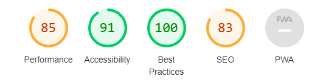
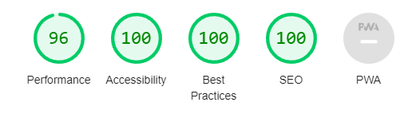

# RemixJS Portfolio Site

A simple portfolio site created using RemixJS

## Setup

Clone and install dependencies

```sh
git clone https://github.com/tohhongxiang/remix-portfolio
cd remix-portfolio

npm install
```

To run development server:

```sh
npm run dev
```

## Adding Projects

Projects are stored as `.md` files within `app/projects`. Each project should include in the frontmatter:

-   `title`: Title of the project
-   `thumbnail`: Thumbnail image link of the project (width of 300px)
-   `description`: A short, one-line description about the project
-   `detailedDescription`: A short paragraph describing the project
-   `githubLink`: Link to github repository of the project
-   `demoLink` (optional): Link to a demo website showcasing the project
-   `screenshots`: An array of links to images for the project (width of 1280px)
-   `date`: The date of the project (used to sort)

Use [Squoosh](https://squoosh.app/) to optimize images.

## Deployment

Update the domain within `sessions.server.ts`, and then push to github. Vercel will automatically handle deployment.

-   The domain doesn't include `https://` (e.g. `portfolio.vercel.app`)

## Optimisations

After the website was mostly complete, I ran the Lighthouse Audit on the webpage using the following options:

| Section    | Value                                           |
| ---------- | ----------------------------------------------- |
| Mode       | Navigation                                      |
| Device     | Mobile                                          |
| Categories | Performance, Accessibility, Best practices, SEO |

The results were as follows:



First, solve the non-performance issues:

- Insufficient contrast between background and foreground (some of my muted text were too light)
- Links do not have a discernable name (A link just named "Details" is not super specific. Modified it to become "Details about \<project>")
- Document does not have a meta description
  - Added a `{ name: "description", meta: "page description" }` to each page (replacing page description with the appropriate page description)

This improved the lighthouse scores to 100 except for performance. Now to tackle performance issues:

- Eliminate render-blocking resources
  - Initially, I was loading the "Inter" font from google by adding 

  ```html
    <link rel="preconnect" href="https://fonts.googleapis.com" crossorigin="anonymous" />
    <link rel="preconnect" href="https://fonts.gstatic.com" crossorigin="anonymous" />
    <link href="https://fonts.googleapis.com/css2?family=Inter:wght@100..900&display=swap" rel="stylesheet" />
  ```

  This did not really improve my performance. However, downloading the font and serving it locally improved performance tremendously.

  ```css
  @font-face {
      font-family: "Inter";
      src: local("Inter"), /* important to put local in front if the user already has the font installed locally */
      url("/fonts/inter/Inter-VariableFont_slnt,wght.ttf") format("truetype");
      font-style: normal;
      font-display: swap;
  }
  ```

  Include a `preload` hint in the `root.tsx` file as well:

  ```html
  <link rel="preload" href="/fonts/inter/Inter-VariableFont_slnt,wght.ttf" as="font" type="font/ttf" crossorigin="anonymous">
  ```

- Largest Contentful Paint element took a long time to load (hero image)
  - Converted the hero image to `.avif` and `.webp` while keeping the `.png` as a fallback. Not using `.jpeg` due to transparency in the image. Then used a `picture` element to correctly render the image

  ```html
    <picture>
        <source
            type="image/avif"
            srcSet="/images/hero.avif"
        />
        <source
            type="image/webp"
            srcSet="/images/hero.webp"
        />
        
    </picture>
  ```
- Large layout shifts
  - Due to images taking some time to load, and then pushing the other elements away. This was solved by giving an explicit width and height to the images, or using `aspect-ratio`
- Avoid enormous network payloads
  - Images below the fold were being loaded, causing the bandwidth to be very high. Solved by giving ``
- Reduce unused Javascript
  - Converted `motion` components in Framer Motion to use `m` and `LazyMotion` as per their [tutorial to reduce bundle size](https://www.framer.com/motion/guide-reduce-bundle-size/)

All these improvements gave the following result:



## Additional Notes

- Images should be sized exactly so that cached images do not suddenly "snap" into their correct dimensions. This is due to images being cached and loading immediately, then the CSS loading to properly resize the image. 

## Resources

-   https://blacksheepcode.com/posts/adding_msw_bundler_to_remix_app
-   https://www.sarasoueidan.com/blog/nested-links/
-   https://www.simeongriggs.dev/serve-dynamic-og-images-from-remix-with-satori
-   https://blog.noelcserepy.com/how-to-animate-svg-paths-with-framer-motion
